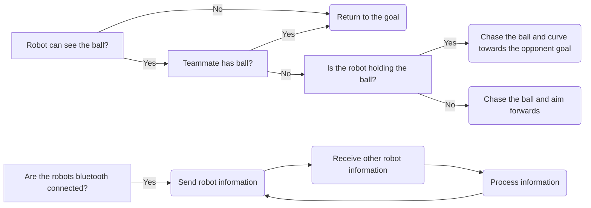
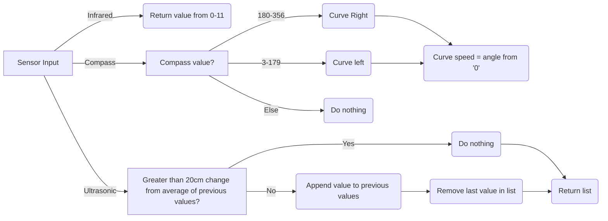

# `NOT FINISHED YET!`
# Menacing Monkeys
## Soccer Standard - *2023 RoboCup Junior Australia*

### **Contents:**
- [Introduction](https://github.com/denyahnov/robocup_2023/blob/main/EngineeringJournal.md#introduction)
- [Strategy](https://github.com/denyahnov/robocup_2023/blob/main/EngineeringJournal.md#strategy)
	- Game
	- Building
	- Robot Logic
- [Robot Design](https://github.com/denyahnov/robocup_2023/blob/main/EngineeringJournal.md#robot-design)
- [Robot Code](https://github.com/denyahnov/robocup_2023/blob/main/EngineeringJournal.md#robot-code)
- [Photos](https://github.com/denyahnov/robocup_2023/blob/main/EngineeringJournal.md#photos)
	- Last Year's Designs
	- New Prototypes
	- Final Design

### **Introduction:**

We are Dennis, Saum and Jones, a group of year 10s from Melbourne High School. We are a small team of 3 and operate on a weekly basis. We have a variety of experience in various robotics competitions and have competed in RoboCup before.

### **Strategy:**
**Game:**
Our strategy was heavily based on adaptability to the current situation. We wanted to be able to get ball possession as quickly as possible after a ball reset as we found that getting to the ball quick enough and to push it into our opponents direction was enough to gain an advantage in matches. We chose to run 2 robots with the same design, opting out of using a designated 'goalie' design. This was partly due to the previously stated decision, but also because we chose to use inter-robot communication. The ability for the robots to relay information like ball possession would allow them to play defense/offense completely autonomously, without the need of specific roles.

**Building:**
We found that while powerful robots are good, we wanted a quick robot than could out-manuever the other team. Because of this, our Robots were designed for speed. The choice to use EV3 Medium Motors for our drivebase was a result of this consideration, as we found that the heavier and larger motors are quite bulky and hard to build a solid design with. Here are some of the [prototypes](https://github.com/denyahnov/robocup_2023/blob/main/EngineeringJournal.md#photos) we designed. We learnt new things and improved the robot with every iteration of the design.

**Robot Logic:**

### **Robot Design:**
Originally, our design choices for this competition were to use 2 identical robots with 4 EV3 Medium Motors, 1 BBR 360 IRSeeker, 1 I2C Compass Sensor, 1 EV3 Ultrasonic Sensor and an EV3 Touch Sensor. We decided that the identity between robots would help resolve issues and keep code as similar as possible. However after the State Competition, we decided to swap from the 360 sensor to 2 HiTechnic IrSeeker v2 Sensors because of their accuracy and reliability.

Because of the limited time working on the robot in person, we began testing out with [different robot designs](https://github.com/denyahnov/robocup_2023/blob/main/EngineeringJournal.md#photos) using parts from home or [Studio 2.0](https://www.bricklink.com/v2/build/studio.page), a virtual LEGO builder.

We use 4 motors with omniwheels positioned around the robot to form an X-drive (holonomic), which allows the robot to move in any direction rather than 2. We use omniwheels that are completely legal since they are built from LEGO pieces. Our design is quite unqiue as the motors are stacked on top of each other to reduce the space consumed by them. We then use gear trains to align the wheel shafts in a perfect X.

This year, we challenged ourselves by using a [BBR IRSeeker](https://irseeker.buildingblockrobotics.com/) which allowed us to have 360 degree infrared vision with just 1 EV3 port used. We had no previous experience using these sensors and through trial and error built our [own wrapper](https://github.com/denyahnov/ir-seeker) based on limited online documentation for easy use of the sensor.

We use the compass for reading our angle which is used in straightening ourselves as well as curving at the opponent goal. We use an  Ultrasonic positioned on the side of our robots to read our position on the field horizontally. This helps the robot figure out where it is on the field at all times. We also use a touch sensor to hit the crossbar of our goal for a defender robot to know it's position.

| **Motor**         |  **Pros**                     |  **Cons**                           |
|------------------ | ----------------------------- | ------------------------------------|
| EV3 Medium Motor  |  Fast, Lightweight, Small     |  Weaker, Need Geartrain for X-Drive |
| EV3 Large Motor   |  Strong, Easy to Incorporate  |  Slower, Bulkier, Heavier           |

### **Robot Code:**
Our robots are coded in [Python](https://www.python.org/) language using the [ev3dev](https://www.ev3dev.org/) library. All our code is publicly available on our [GitHub repository](https://github.com/denyahnov/robocup_2023/). 

We built our own wrappers for [ev3dev](https://github.com/denyahnov/robocup_tools) and the [infrared sensor](https://github.com/denyahnov/ir-seeker). These allowed us to have Custom Menus and ready to use Classes which sped up our coding process.

We have structured our code very methodically. Python allows us to import code from different files and compile it into one main file:
- `behaviours.py` stores all our robot behaviours such as Attack, Chase, Defend, Track, etc
- `brick.py` stores our system functions such as changing brick color and playing a sound
- `calibration.py` allows us to calibrate our sensors as well as storing the values
- `comms.py` allows us to connect the 2 robots via bluetooth and send information between them
- `custom_sensors.py` stores the classes for any custom sensors we use like the IR Seeker
- `drivebase.py` initalises our motors and stores all our movement functions
- `main.py` is the main file that we run
- `menu.py` allows us to run a Graphical User Interface within the program
- `sensors.py` initalises our sensors and stores all the sensor related functions

We started off by using [EV3Sim](https://ev3sim.mhsrobotics.club/), an application developed by the school to practice coding in a virtual environment. It helped us build the foundation of our code while working from home.

We use a holonomic drive which allows us to move in any direction. We use a simple formula to calculate each motor's speed based on a given angle from 0-360 degrees. 

Our code accounts for robot inconsistency and faulty sensors. The main chunk of logic stays the same but small functions like converting ball position to robot direction has configurable variables that shift between robots. We use algorithms to average our Ultrasonic sensor values remove outliers, excluding any extremely rapid increases/decreases in value as to account for objects blocking the ultrasonic.

We use bluetooth for communication between robots. We have one robot run as a server and the other connects afterwards as a client. The robots relay whatever information they recieve between themselves e.g. Ball Possession, Current Attack/Defense State, etc.

We do not use any sensors like touch or colour to detect if the robot has possession of the ball, instead we use the infrared proximity. We instead use a touch sensor to hit the crossbar of our goal for the robot to know it's position.

We even tried using odometry to locate our robot on the field without the use of sensors. By using the motor degree positions, we could estimate where we were on the field given we calibrate before the match begins. Unfortunately, we found that referees picking our robots up and robot being knocked over would ruin the data, providing an inaccurate location.

We made an easy way for us to debug code and see sensor values by visualing the robot position. We pass it the ball angle and strength, and it returns out an x,y position.

We use a cubic function to correct our turning angle based on how far we are from a target angle.

During our testing, we found it hard to see what the robot was actually thinking. This led us to developing a graphical visualiser which could replay matches based on data that the robot saved.

### **Photos:**
#### **Last year's designs:**

#### **New Prototypes:**

**Design 1 - Version 1**

 

**Design 2 - Version 1**

**Design 2 - Version 2**

**Design 2 - Version 3**

**Design 2 - Version 4**

#### **Design 2 - Version 5:**

#### **Victorian States Design:**

#### **Australian Nationals Redesign**

